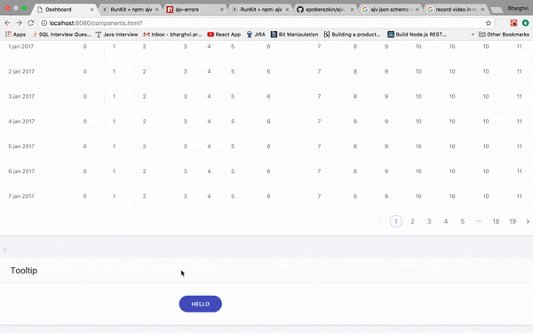

# react-tooltip

A simple react component to add tooltip to the target element.

## Usage

Include the file tooltip.js in your current working file, by `import` or `require`.

```javascript
import Tooltip from 'react-tooltip'

<Tooltip
      size={'small'}
      cross={true}
      target={targetM()}
      place={'right'}
      content={tooltipdata()}
      eventOn={'mouseover'}
      contentClass={''}
/>
```
Here, `target` should be a markup/element over which we expect to have our tooltip.

## Props

Prop Name | Type | Usage
------------ | ------------- | -------------
size | string | specify size `xsmall`, `small`, `medium` and `large`
cross | boolean | when you desire closing the tooltip via close(cross) button 
target | html markup | markup over which we desire to have tooltip
place | string | location of tooltip viz. `top`, `bottom`, `right` and `left`
content | | data to be displayed in tooltip (it can be markup/elements too) 
eventOn | string | event on which tooltip should appear; these are basic js events viz `click`, `mouseover`, etc.
contentClass | string | class of tooltip content for styling purpose (if required)

## Example



   
